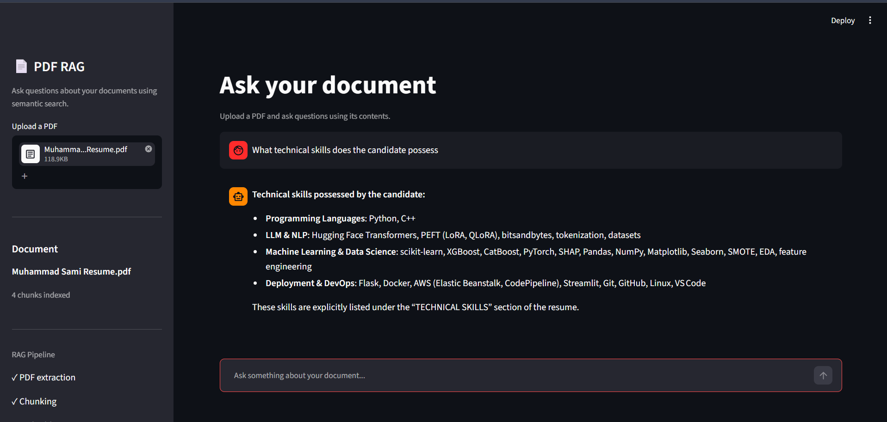

# PDF RAG Assistant

A lightweight Retrieval-Augmented Generation (RAG) application for asking questions about PDF documents.

The system extracts PDF text, splits it into chunks, generates embeddings, retrieves relevant chunks using FAISS, and passes the retrieved context to an LLM to generate an answer.

## Demo



## Architecture

```text
PDF
 ↓
PyMuPDF
 ↓
Chunking
 ↓
Embeddings
 ↓
FAISS
 ↓
Relevant Chunks
 ↓
LLM
 ↓
Answer
```

## Features

* PDF text extraction with page tracking
* Custom chunking with overlap
* Semantic search using embeddings
* FAISS vector similarity search
* LLM-powered answers
* Streamlit chat interface

## Tech Stack

* Python
* PyMuPDF
* OpenAI Embeddings
* FAISS
* Streamlit
* LLM API

## Project Structure

```text
pdf-rag/
├── app/
│   ├── pdf_loader.py
│   ├── chunker.py
│   ├── embeddings.py
│   ├── vector_store.py
│   └── rag.py
├── data/
├── assets/
├── app.py
├── test_rag.py
├── requirements.txt
└── README.md
```

## Run Locally

```bash
git clone https://github.com/YOUR_USERNAME/pdf-rag.git
cd pdf-rag

python -m venv venv
venv\Scripts\activate

pip install -r requirements.txt
```

Create a `.env` file:

```env
API_KEY=your_llm_api_key
EMBEDDING_KEY=your_embedding_api_key
```

Run:

```bash
streamlit run app.py
```

## Future Improvements

* Source/page citations
* Better chunking
* Batch embeddings
* Persistent vector storage
* PostgreSQL + pgvector
* Multi-document support
* Hybrid retrieval and reranking
* FastAPI backend

## Purpose

Built to understand the core mechanics of RAG — from document processing and embeddings to vector retrieval and LLM generation.
